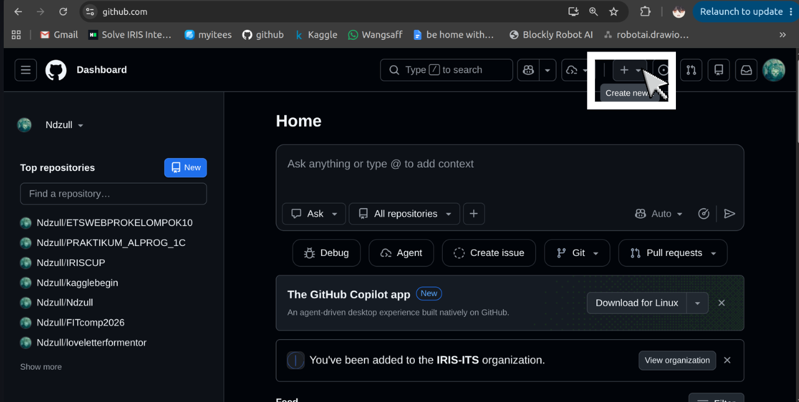
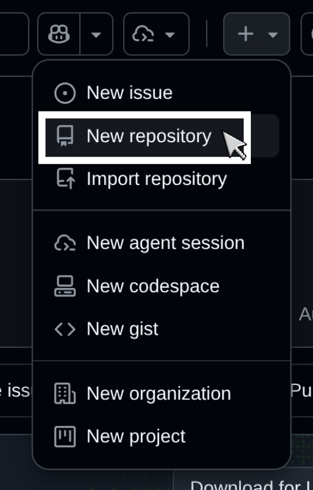
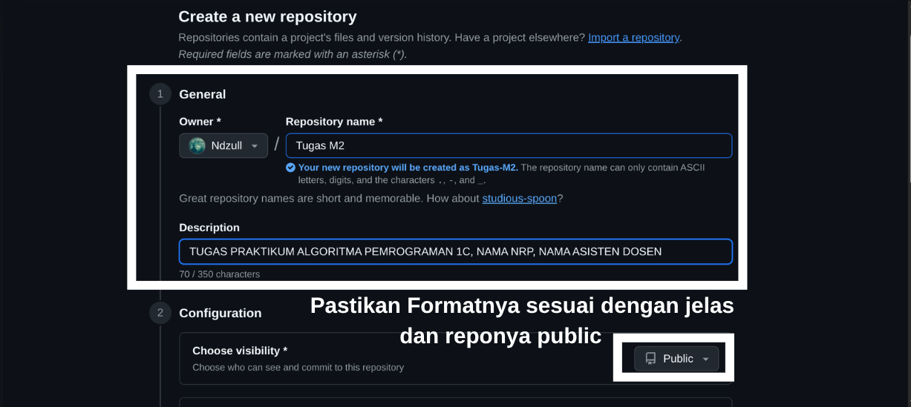
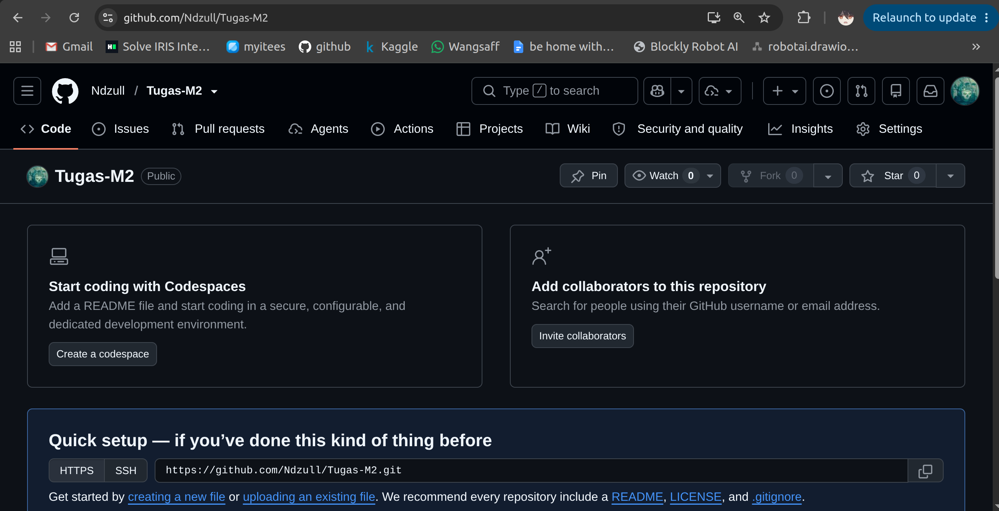
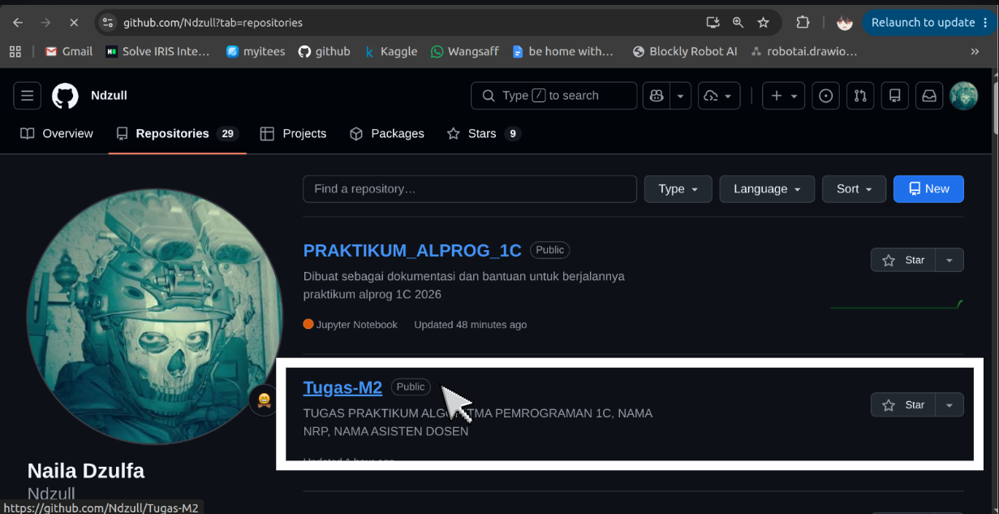
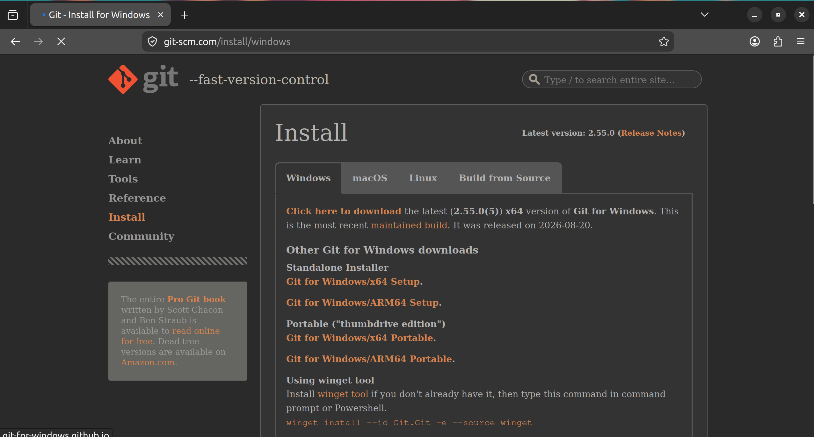

# Cara Buat Repository di Github

1. Buka situs web GitHub di https://github.com<br>
2. Klik tombol "Sign up" untuk membuat akun baru (jika belum memiliki akun) atau login ke akun yang sudah ada.<br><br>
3. Setelah login, klik tombol "New" di bagian kiri atas<br><p></p><br>
4. Masukkan nama repository<br>
5. Pastikan opsi repository adalah public<br><br>
6. Klik tombol "Create Repository"<br><br>
7. Repository berhasil dibuat dan siap digunakan<br>
<br><br>
notes:<br>
- Pastikan nama repository sesuai dengan nama tugas (contoh: Tugas M2)
- Pada deskripsi repository WAJIB diisi dengan nama tugas, nama mata kuliah, nama lengkap, NRP, dan nama asdos (contoh: Nama Tugas -  Nama Mata Kuliah - Nama Lengkap - NRP - Nama Asdos)<br>
- Jika tidak dilampirkan pada deskripsi, bisa dilampirkan pada file README.md di repository tersebut. Atau tugas dianggap tidak valid.<br>

---

# Cara upload file ke repository
## Cara manual
1. Buka repository yang telah dibuat<br><br>
2. Klik tombol "Add file" dan pilih "Upload files"<br>
3. Pilih file yang ingin diupload<br>
4. Klik tombol "Commit changes" untuk menyimpan perubahan<br>
## Cara menggunakan Git
1. Pastikan Git sudah terinstall di device kalian (bisa diinstall dari https://git-scm.com/downloads)<br><br>
2. Buka terminal atau command prompt IDE kalian (contoh: Vscode)<br>
3. Initialize repository Git di folder project kalian dengan perintah:<br>
   ```
   git init
   ```
4. Clone repository yang telah dibuat dengan perintah:<br>
   ```
   git clone <URL_REPOSITORY>
   ```
5. Masuk ke folder repository yang telah di-clone dengan perintah:<br>
   ```
   cd <NAMA_REPOSITORY>
   ```
6. Tambahkan file yang ingin diupload ke repository dengan perintah:<br>
   ```
   git add <NAMA_FILE>
   ```
7. Commit perubahan dengan perintah:<br>
   ```
   git commit -m "Pesan commit"
   ```
8. Push perubahan ke repository dengan perintah:<br>
   ```
   git push origin main
   ```
