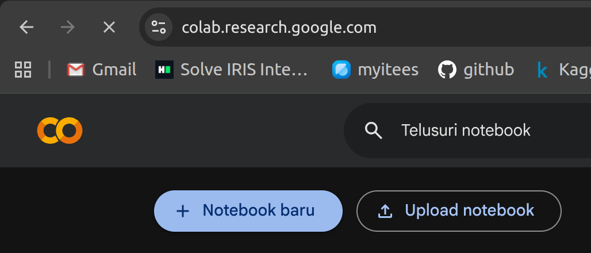
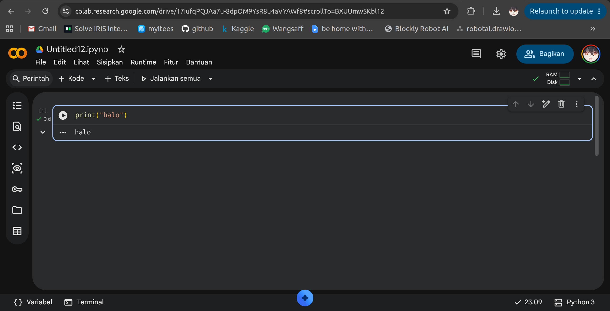
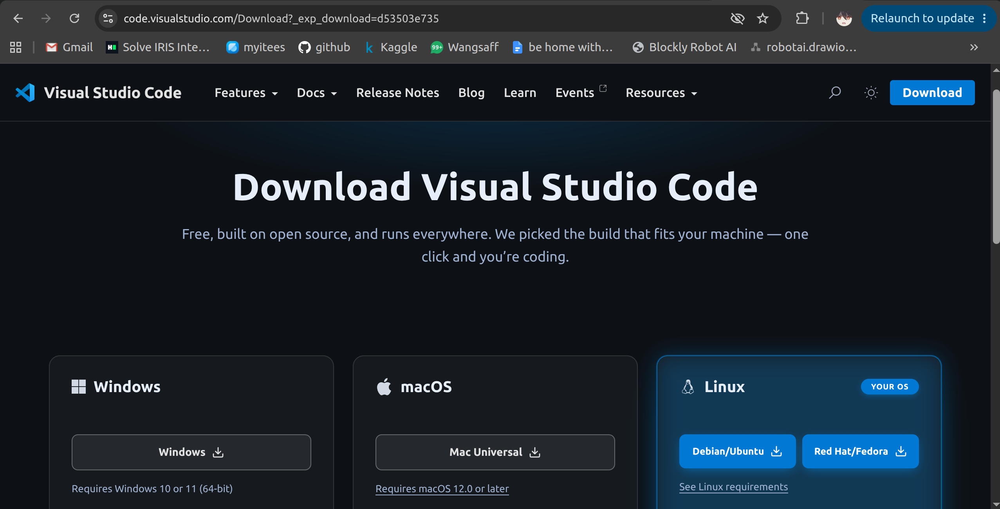
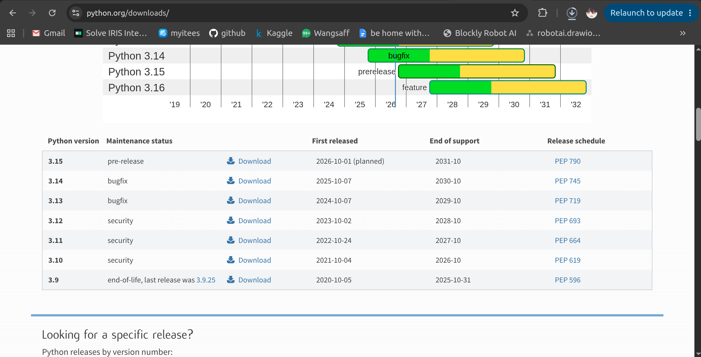
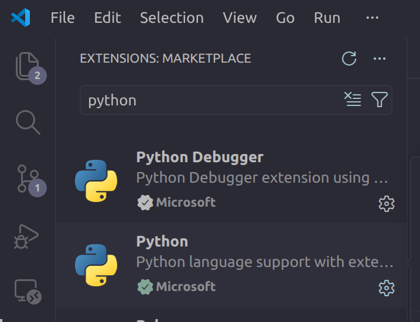
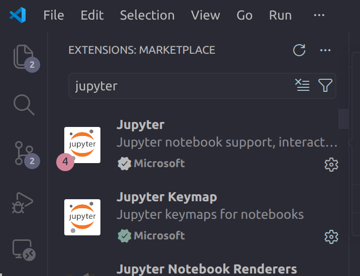

<h1>Setting Workspace</h1>
Mungkin beberapa dari kalian sudah mempersiapkan workspace untuk praktikum ini kedepannya. Memang ada beberapa saran IDE yang bisa digunakan seperti Anaconda, Google Colab, VSCode dan yang lain. 
Namun, mengingat Anaconda menurutku cukup berat dan UI nya kurang familiar aku sarankan teman-teman menggunakan Google Colab atau VSCode.  
Berikut aku kasih sedikit panduan untuk setting workspace di Google Colab dan VSCode.  
 
<h2>Google Colab</h2>
1. Buka Google Colab di browser kalian --> https://colab.research.google.com/ 
2. Klik "New Notebook"  
  
3. Pilih "Python 3" / pastikan runtime kalian Python 3  
4. Selesai, kalian sudah bisa menggunakan Google Colab untuk praktikum ini  
  
 
<h2>VSCode</h2>
1. Download dan install VSCode di komputer kalian, bisa di cek di website resminya rek  disini --> https://code.visualstudio.com/Download?_exp_download=d53503e735 
Sesuaikan dengan OS yang kalian gunakan ya.  
  
2. Download dan install Python di komputer kalian, bisa cek juga website resminya di sini --> https://www.python.org/downloads/  Bebas mau versi berapa, tapi aku sarankan untuk install versi 3.14 atau yang terbaru 
  
3. Buka VSCode, klik "Extensions" di sidebar kiri / ctrl + shift + x 
4. Ini opsional, tapi aku sarankan untuk install extension "Python"  
5. Ini opsional, tapi aku sarankan untuk install extension "Jupyter" juga biar bisa langsung bikin notebook di VSCode  
   
6. Selesai, kalian sudah bisa menggunakan VSCode untuk praktikum ini  
notes: kalau mau nambahin notebook di vscode itu ctrl + shift + p, lalu ketik Create:New Jupyter Notebook, nanti bakal muncul file baru dengan ekstensi .ipynb  